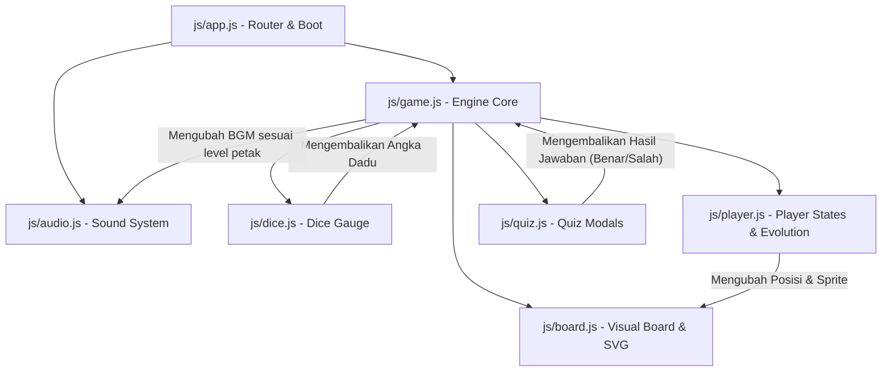

# Arsitektur Proyek dan Deskripsi Berkas
### Proyek: Ular Tangga Tata Tertib IPB University

Proyek ini menggunakan arsitektur web murni (Vanilla Tech Stack) dengan pendekatan **SPA (Single Page Application)** berbasis komponen modern. Untuk memudahkan kolaborasi dan skalabilitas, logika game dipisahkan menjadi modul-modul JavaScript (ES6 Modules) yang saling berinteraksi secara searah (unidirectional data flow).

---

## 📂 Struktur Berkas dan Folder

Berikut adalah visualisasi struktur lengkap dari repositori proyek:

```
gkv-final/
├── docs/                      # Hub Dokumentasi
│   ├── README.md              # Index utama dokumentasi
│   ├── AGENTS.md              # Batasan operasional & aturan bagi AI Agent
│   ├── architecture.md        # Panduan berkas & alur data proyek [BERKAS INI]
│   ├── game_rules_mechanics.md# Mekanika permainan & detail dadu
│   ├── game_content.md        # Bank data tata tertib, kuis, & hadiah
│   └── assets_design.md       # Spesifikasi audio & evolusi sprite karakter
├── src/                       # Kode Sumber Utama Game
│   ├── index.html             # Dokumen HTML utama (DOM & layout global)
│   ├── css/
│   │   ├── main.css           # Desain sistem global (warna, tipografi, grid)
│   │   ├── board.css          # Styling visualisasi papan permainan & SVG overlay
│   │   └── ui.css             # Desain menu, dice gauge, status bar, & pop-up modal
│   ├── js/
│   │   ├── app.js             # Navigasi halaman, router, & bootstrapper game
│   │   ├── game.js            # Engine Core (State Machine, giliran, bot, win/loss)
│   │   ├── board.js           # Penggambaran Papan 10x10 & SVG Ular/Tangga
│   │   ├── dice.js            # Mekanika Dice Gauge & lemparan dadu
│   │   ├── player.js          # Kelas Pemain, evolusi sprite punk -> duta, token
│   │   ├── quiz.js            # Mekanika Kuis & validasi jawaban
│   │   └── audio.js           # Sistem pemutar audio BGM dinamis & SFX
│   └── assets/                # Aset Game
│       ├── audio/             # Sound Effects (SFX) & Background Music (BGM)
│       └── sprites/           # File gambar 17 sprite evolusi karakter
├── README.md                  # Halaman utama repositori GitHub
├── package.json               # Konfigurasi Live Server (dev, start & testing)
└── server.js                  # Server HTTP statis Node.js dengan kompresi Gzip bawaan
```

---

## 🛠️ Deskripsi Fungsionalitas Berkas

### 1. File Root & HTML Utama
*   **`src/index.html`**: Satu-satunya berkas HTML. Berfungsi sebagai penampung DOM utama. Semua transisi halaman (Main Menu, Setup Players, Prologue, Board Game Screen, Game Over Screen) dikelola dengan menyembunyikan/menampilkan section berkas lewat CSS (menggunakan kelas `.hidden`).
*   **`README.md`**: Informasi publik repositori, daftar kontributor, deskripsi game, dan langkah instalasi dasar.
*   **`package.json`**: Menyediakan konfigurasi dependensi dan skrip shortcut (`npm start` dan `npm run dev`) untuk mempermudah menjalankan server lokal statis bawaan Node.js.
*   **`server.js`**: Server HTTP statis Node.js premium tanpa dependensi luar. Mendukung penanganan kompresi **gzip otomatis (`zlib`)** untuk mencegah lag transmisi berkas statis, logger terminal berwarna, perlindungan directory traversal, caching web, dan penanganan status error 404/500 secara aman.

### 2. Modul JavaScript (`src/js/`)
Semua kode program JavaScript ditulis menggunakan **ES6 Modules** (`import`/`export`) demi menjaga keterbacaan, keterawatan, dan isolasi fungsionalitas.

*   **`js/app.js`**:
    *   Mengatur transisi antarmuka (Routing) antar layar.
    *   Menangani pengaturan awal permainan (inisialisasi jumlah pemain, pendaftaran nama, dan aktivasi AI Bot).
    *   Memicu inisialisasi awal seluruh modul lain (`audio.js`, `board.js`, `game.js`).
*   **`js/game.js`**:
    *   *Heartbeat* permainan. Berfungsi sebagai State Machine utama game (`PRE_GAME`, `PROLOGUE`, `PLAYING`, `PAUSED`, `QUIZ_MODAL`, `SKULL_MODAL`, `GAME_OVER`).
    *   Mengelola giliran pemain (*Turn Management*), penghitung timer giliran (10 detik), dan memicu gerakan AI Bot saat gilirannya tiba.
    *   Mengecek kondisi menang (tepat mendarat di petak 100) atau kalah (Drop Out karena petak tengkorak 3 kali).
*   **`js/board.js`**:
    *   Merender visualisasi papan 10x10 ke dalam DOM.
    *   Menggambar jalur Ular dan Tangga secara dinamis menggunakan **SVG Overlay** di atas papan. Jalur digambar secara otomatis berdasarkan koordinat tengah dari petak awal dan akhir.
    *   Mengatur reposisi token pemain secara dinamis agar tidak bertumpuk jika berada di petak yang sama.
*   **`js/dice.js`**:
    *   Mengimplementasikan mekanika **Dice Gauge** (pengukur daya interaktif).
    *   Mendeteksi aksi penahanan tombol dadu (*mouse down* / *touch start*) dan pelepasan tombol (*mouse up* / *touch end*) untuk menghitung `chargePercent`.
    *   Mengunci angka target dadu berdasarkan rentang persentase pengisian daya dadu.
    *   Memicu animasi dadu bergulir (3D/2D visual rolling).
*   **`js/player.js`**:
    *   Mendefinisikan *class* `Player` yang memuat data: nama, indeks, posisi petak saat ini (0-100), status skorsing, jumlah pelanggaran tengkorak, tingkat evolusi, dan status AI Bot.
    *   Menangani transisi evolusi karakter secara otomatis ketika posisi melewati batas (25, 50, 75, 100).
*   **`js/quiz.js`**:
    *   Menyimpan bank soal kuis mengenai Peraturan Akademik & Tata Tertib IPB.
    *   Merender modal pertanyaan kuis, pilihan ganda, dan mengecek kebenaran jawaban pemain.
*   **`js/audio.js`**:
    *   Mengelola pustaka suara game.
    *   Memutar BGM yang berbeda untuk setiap fase semester/level petak secara otomatis.
    *   Memutar SFX seperti dadu berputar, sanksi tengkorak (bom), ular merosot, tangga naik, kuis benar/salah, dan lagu kemenangan.

### 3. File Desain & CSS (`src/css/`)
*   **`css/main.css`**: Berisi fondasi visual aplikasi. Menampung variabel CSS (CSS Variables) untuk warna dasar IPB University (Biru Tua, Emas, Putih, dll.), *reset* margin, konfigurasi tipografi global, efek kaca (*Glassmorphism*), dan animasi dasar.
*   **`css/board.css`**: Khusus mengatur styling dari papan grid 10x10, visualisasi petak khusus (petak tengkorak hitam, kuis biru tanda tanya, tangga cokelat, ular hijau), SVG overlay, serta pergerakan mulus bidak (*piece transition*).
*   **`css/ui.css`**: Styling antarmuka non-papan seperti tombol Glassmorphism modern, layout setup pemain, meteran *Dice Gauge* yang berdenyut dinamis, status bar pemain di pinggir layar, panel narasi prologue, dan modal pop-up kuis.

---

## 🔄 Diagram Interaksi dan Alur Data

Secara arsitektural, modul-modul ini terhubung secara terstruktur seperti digambarkan oleh diagram berikut:



### 🎮 Siklus Perjalanan Giliran (Game Turn Loop)
1.  **Start Turn:** `game.js` mengaktifkan giliran `Player X` dan memulai timer 10 detik. Jika player adalah Bot, game akan memicu pelemparan otomatis setelah delay 1.5 detik.
2.  **Dice Roll Input:** Pemain menahan tombol dadu, mengaktifkan `dice.js` untuk menaikkan gauge. Saat dilepas, `dice.js` mengunci angka dadu dan mengirimkannya kembali ke `game.js`.
3.  **Movement:** `game.js` memperbarui posisi `Player X` secara bertahap (1 per 1 petak) di dalam `player.js`, lalu memanggil `board.js` untuk merender animasi perpindahan bidak di layar.
4.  **Tile Action Trigger:** Ketika bidak berhenti di petak tujuan:
    *   **Petak Biasa:** Menampilkan pop-up motivasi belajar/prestasi kecil, lalu giliran selesai.
    *   **Petak Tangga / Ular:** Bidak bergeser otomatis mengikuti rute, menampilkan pop-up alasan, lalu giliran selesai.
    *   **Petak Kuis (?):** `game.js` memanggil `quiz.js` untuk menampilkan soal kuis. Jika benar, pemain melangkah maju (opsional, sesuai game rules); jika salah, tetap di tempat atau mundur. Giliran selesai setelah modal ditutup.
    *   **Petak Tengkorak:** Menampilkan sanksi, menandai status skorsing pemain untuk giliran berikutnya, memotong posisi mundur 4 baris, menambah hitungan pelanggaran tengkorak. Giliran selesai.
5.  **Check Game Status & Turn Swap:** `game.js` memeriksa apakah ada pemain yang mencapai petak 100 (Win) atau mendapat drop out (karena petak tengkorak 3x). Jika tidak ada, giliran digeser ke `Player X+1`.
