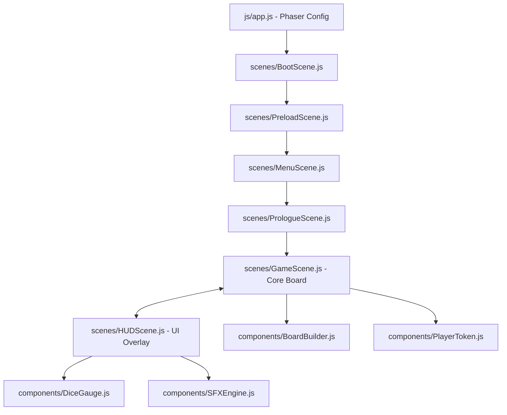

# Arsitektur Proyek dan Deskripsi Berkas (PhaserJS Edition)
### Proyek: Ular Tangga Tata Tertib IPB University
### Mata Kuliah: Grafika Komputer dan Visualisasi

Proyek ini dibangun menggunakan **PhaserJS (Phaser 3)**, sebuah engine game HTML5 berkinerja tinggi berbasis WebGL dan Canvas. Logika permainan dan render grafis dikelola secara modular melalui pemisahan adegan (**Phaser Scenes**) dan komponen logika terisolasi. Arsitektur ini memastikan game berjalan stabil di kisaran 60 FPS dengan rendering maksimalis bebas lag.

---

## 📂 Struktur Berkas dan Folder

Berikut adalah visualisasi struktur repositori setelah migrasi ke arsitektur PhaserJS:

```
gkv-final/
├── docs/                      # Hub Dokumentasi Lengkap
│   ├── README.md              # Index utama dokumentasi
│   ├── AGENTS.md              # Batasan operasional AI Agent (Anti-Commit/Push)
│   ├── architecture.md        # Panduan berkas & alur adegan Phaser [BERKAS INI]
│   ├── game_rules_mechanics.md# Mekanika permainan & detail dadu
│   ├── game_content.md        # Bank data tata tertib, kuis, & hadiah
│   └── assets_design.md       # Spesifikasi aset Phaser, partikel, & audio
├── src/                       # Kode Sumber Utama Game
│   ├── index.html             # Entry point HTML5 (menampung Canvas & UI Overlay)
│   ├── css/
│   │   ├── main.css           # Token warna global & desain Glassmorphism
│   │   └── ui.css             # Styling UI HUD overlay di atas Canvas
│   ├── js/
│   │   ├── app.js             # Bootstrapper utama & konfigurasi Phaser 3
│   │   ├── scenes/            # Direktori Adegan (Scenes) Phaser
│   │   │   ├── BootScene.js   # Memuat loader bar & aset awal
│   │   │   ├── PreloadScene.js# Preloader asinkron seluruh aset visual & suara
│   │   │   ├── MenuScene.js   # UI menu utama & konfigurasi pemain/bot
│   │   │   ├── PrologueScene.js# Pengantar naratif dengan efek typewriter & parallax
│   │   │   ├── GameScene.js   # Arena utama papan 10x10, ular, tangga, & token
│   │   │   └── HUDScene.js    # Lapisan UI paralel overlay (Dice Gauge, Timer, Modal)
│   │   ├── components/        # Komponen Logika Modular Game
│   │   │   ├── BoardBuilder.js# Alur pembentuk grid 10x10 & render Graphics neon
│   │   │   ├── DiceGauge.js   # Mekanisme pengisian daya dadu (LGR Style)
│   │   │   ├── PlayerToken.js # Kelas bidak dengan sistem tween & evolusi sprite
│   │   │   └── SFXEngine.js   # Pemutar musik & synthesizer audio chiptune
│   │   └── contentData.js     # Modul bank data soal kuis, ular, & tangga
├── package.json               # Konfigurasi npm script (start & dev)
├── server.js                  # Server statis lokal dengan Gzip aktif (zlib)
└── README.md                  # Halaman utama repositori GitHub
```

---

## 🛠️ Deskripsi Fungsionalitas Berkas

### 1. File Root & HTML Entry Point
*   **`src/index.html`**: Entry point tunggal. Berfungsi sebagai wadah bagi Canvas Phaser 3 WebGL dan menampung elemen DOM absolut di atasnya (untuk overlay UI Glassmorphism seperti layar kuis).
*   **`server.js`**: Server statis lokal zero-dependency dengan kompresi **gzip otomatis (`zlib`)** yang krusial untuk mempercepat loading aset gambar resolusi tinggi dan berkas JSON game di browser.
*   **`package.json`**: Script shortcut (`npm start`) untuk mengaktifkan `server.js` dengan port 3000.

### 2. Konfigurasi Utama (`src/js/app.js`)
*   Inisialisasi game Phaser menggunakan objek konfigurasi `Phaser.Types.Core.GameConfig`.
*   Mengatur tipe render (`Phaser.AUTO` yang memprioritaskan **WebGL** dengan fallback **Canvas**).
*   Menentukan resolusi dasar yang responsif dan sistem skala (`Phaser.Scale.FIT`) agar papan otomatis menyesuaikan ukuran layar perangkat tanpa merusak rasio visual.
*   Mendaftarkan seluruh Scene game ke dalam sistem manajer scene Phaser.

### 3. Pengelola Alur Adegan (`src/js/scenes/`)
*   **`BootScene.js`**: Adegan awal yang sangat ringan. Bertanggung jawab memuat grafis loading bar neon IPB dan memicu transisi cepat ke Preload.
*   **`PreloadScene.js`**: Preloader asinkron. Memuat 17 lembar sprite evolusi karakter, 100 gambar gedung kampus (untuk skin petak unik), aset suara MP3, dan font modern. Menampilkan progres loading bar yang halus secara visual.
*   **`MenuScene.js`**: Adegan menu utama dengan tampilan Glassmorphism beraksen emas IPB. Menangani pengaturan awal jumlah pemain, penamaan, dan pemilihan jenis bot AI.
*   **`PrologueScene.js`**: Sinematik pengantar cerita mahasiswa baru. Menggunakan efek gulir latar belakang (*parallax*), partikel debu melayang, dan efek teks mengetik (*typewriter effect*).
*   **`GameScene.js`**: Core Engine utama dari papan permainan.
    *   Mengatur giliran pemain, timer putaran, koordinat petak zig-zag 10x10.
    *   Menggambar rute lintasan ular (melengkung berdenyut neon) dan tangga (pijakan glowing) menggunakan `Phaser.GameObjects.Graphics`.
    *   Mengatur reposisi token pemain agar tidak bertumpuk jika berada di petak yang sama.
*   **`HUDScene.js`**: Berjalan secara paralel di atas `GameScene` untuk memisahkan logika UI dengan visual papan. Menangani timer 10 detik, sidebar status bar, meteran pengisi daya dadu (*Dice Gauge*), dan modul kuis overlay.

### 4. Komponen Logika Modular (`src/js/components/`)
*   **`BoardBuilder.js`**: Bertugas menghitung tata letak sel koordinat papan zig-zag dan menggambar garis visual kurva Bezier bercahaya untuk ular dan tangga secara dinamis.
*   **`PlayerToken.js`**: Membungkus objek Sprite bidak. Menangani transisi perpindahan asinkron langkah-demi-langkah (menggunakan *Phaser Tweens* dengan efek pantulan *elastic easing*) dan mendeteksi perubahan sprite ketika bidak melewati petak batas evolusi.
*   **`DiceGauge.js`**: Logika pengukur dadu. Mendeteksi aksi input sentuhan/mouse untuk mengisi energi dadu, serta memicu animasi berputarnya dadu 3D/2D.
*   **`SFXEngine.js`**: Sistem audio modular yang otomatis mengatur pergantian musik dinamis per semester dan mensintesis suara retro chiptune (menggunakan *Web Audio API*) apabila berkas MP3 fisik kosong.

---

## 🔄 Diagram Interaksi Adegan dan Alur Data Phaser

Seluruh adegan dan komponen logika di dalam engine Phaser 3 terhubung sebagai berikut:



### 🎮 Siklus Perjalanan Giliran di Phaser (Game Turn Loop)
1.  **Turn Activation:** `GameScene` mengaktifkan giliran `PlayerToken`. Kamera melakukan *zoom-in* secara halus ke koordinat bidak aktif. Adegan HUD menampilkan nama pemain dan mengaktifkan timer 10s.
2.  **Dice Roll:** Pemain menahan tombol dadu. `DiceGauge` di HUDScene berdenyut warna neon dan mengukur daya. Saat dilepas, angka dadu dikirim ke `GameScene`.
3.  **Step Movement:** `GameScene` memicu pergerakan bidak langkah-demi-langkah di `PlayerToken`. Kamera mengikuti gerakan bidak secara dinamis (*camera follow*). Bidak memantul secara elastis di setiap sel yang dilewatinya.
4.  **Evolusi Real-Time:** Saat bidak melintasi batas petak (misal petak 25), `PlayerToken` memicu efek partikel ledakan kecil dan memperbarui tekstur sprite karakter ke tingkat berikutnya secara instan.
5.  **Tile Action Trigger:** 
    *   **Petak Tangga:** Kamera bergeser lambat mengikuti gerakan bidak meluncur naik diiringi jejak partikel bintang berkilauan.
    *   **Petak Ular:** Kamera bergetar kecil, bidak meluncur turun diselimuti asap partikel hijau beracun.
    *   **Petak Kuis:** HUDScene memicu pop-up dialog kuis. Evaluasi jawaban menentukan apakah kamera mundur atau mendapat bonus maju.
6.  **End Turn:** Kamera kembali melakukan *zoom-out* untuk menampilkan seluruh papan, lalu giliran dipindahkan ke pemain berikutnya.
